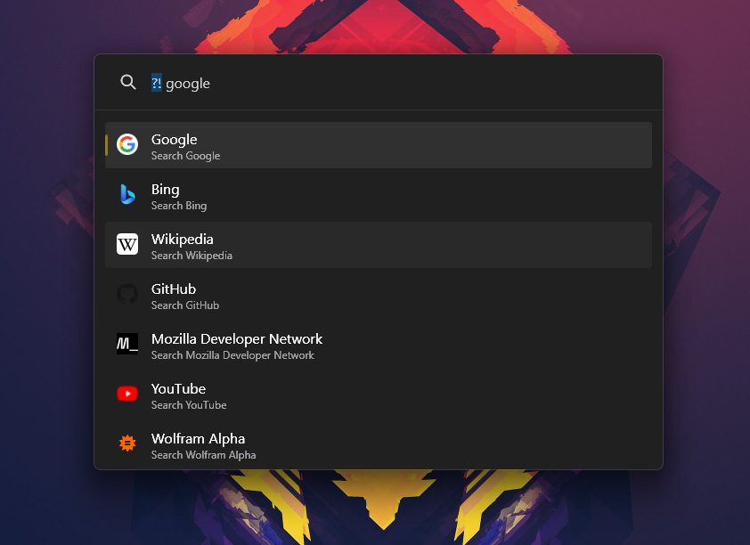

# `SearchEngines`

A PowerToys Run Plugin that allows you to perform a search using search-engines.



## 📖 Usage

> ?! PowerToys Run Plugins GitHub

1. Open PowerToys Run (<kbd>Alt</kbd> + <kbd>Space</kbd>)
2. Use the `ActionKeyword` (`?!`) followed by the search query
3. Select the desired search-engine from the list of suggestions
4. Press <kbd>Enter</kbd> to open the search results using the default browser

## 📦 Installation

1. Close PowerToys
2. Download the latest release from the [releases page][releases]
3. Extract the zip archive
4. Move the extracted folder (`SearchEngines`) to the PowerToys Run Plugins directory (`%LOCALAPPDATA%\Microsoft\PowerToys\PowerToys Run\Plugins`)
5. Start PowerToys

## 🛠️ Configuration

The plugin can be configured by editing the `Configuration\SearchEngines.json` file located in the plugin directory (`%LOCALAPPDATA%\Microsoft\PowerToys\PowerToys Run\Plugins\SearchEngines\`).

```json
[
    {
      "Name": "Google",
      "Url": "https://www.google.com/search?q=%s",
      "Shortcut": "google"
    },
    {
      "Name": "Bing",
      "Url": "https://www.bing.com/search?q=%s",
      "Shortcut": "bing"
    },
    {
        "Name": "Mozilla Developer Network",
        "Url": "https://developer.mozilla.org/en-US/search?q=%s",
        "Shortcut": "mdn",
    },
    {
        "Name": "Wolfram Alpha",
        "Url": "https://www.wolframalpha.com/input/?i=%s",
        "Shortcut": "wolfram",
    }
]
```

> [!TIP]
>
> `Url` doesn't always have to be a search-engine. It can be any URL. The `%s` will be replaced with the search query. For example:
>
> ```json
> {
>   "Name": "Learn X in Y Minutes",
>   "Url": "https://learnxinyminutes.com/docs/%s",
>   "Shortcut": "lxym"
> }  
> ```

## 🔗 Related

- [Microsoft PowerToys](https://github.com/Microsoft/PowerToys)

---

## 📄 License

This project is licensed under the [MIT License](./LICENSE).

[releases]: https://github.com/Shresht7/PowerToysRun-SearchEngines/releases
